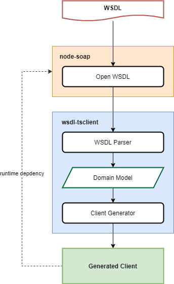

# WSDL TSClient

[](https://travis-ci.org/dderevjanik/wsdl-tsclient)

[](https://snyk.io/test/github/dderevjanik/wsdl-tsclient)
[](https://npmjs.com/package/wsdl-tsclient)

**Example how to generate and use wsdl-tsclient:** [wsdl-tsclient-example](https://github.com/dderevjanik/wsdl-tsclient-example)

Generate a [soap client](https://www.npmjs.com/package/soap) with typescript definitions from a WSDL file.

This library uses [ts-morph](https://www.npmjs.com/package/ts-morph) to generate typescript code and [soap](https://github.com/vpulim/node-soap) for runtime. Inspired by Java [wsimport](https://docs.oracle.com/javase/8/docs/technotes/tools/unix/wsimport.html) and [openapi-generator](https://github.com/OpenAPITools/openapi-generator).

*NOTE:* Add [soap](https://www.npmjs.com/package/soap) to your npm runtime dependencies (`npm i soap`).

## Install

```sh
npm i wsdl-tsclient
```

or install it with `-g` to have CLI globally available.

```sh
npm i -g wsdl-tsclient
```

## Usage

You can check example repository [wsdl-tsclient-example](https://github.com/dderevjanik/wsdl-tsclient-example)

### Generate client using CLI

Easiest way to generate client from is to use CLI. You need to provide only path to `.wsdl` file and
path to output directory (`-o` param). If you want to generate **only typescript types** (no runtime code) for node-soap, you can pass `--emitDefinitionsOnly` param.

`wsdl-tsclient ./soap.wsdl -o ./generated`

`wsdl-tsclient ./resources/**/*.wsdl -o ./generated` - using glob

you can also use `npx`

`npx wsdl-tsclient ./soap.wsdl -o ./generated`

```bash
wsdl-tsclient [options] [path]

Options:
      --help                        Show help                          [boolean]
  -v, --version                                                        [boolean]
  -o                                Output directory         [string] [required]
      --emitDefinitionsOnly         Generate only Definitions          [boolean]
      --modelNamePreffix            Prefix for generated interface names[string]
      --modelNameSuffix             Suffix for generated interface names[string]
      --caseInsensitiveNames        Case-insensitive name while parsing
                                    definition names                   [boolean]
      --maxRecursiveDefinitionName  Maximum count of definition's with same name
                                    but increased suffix. Will throw an error if
                                    exceed                              [number]
      --quiet                       Suppress all logs                  [boolean]
      --verbose                     Print verbose logs                 [boolean]
      --no-color                    Logs without colors                [boolean]

Examples:
    wsdl-tsclient file.wsdl -o ./generated/
    wsdl-tsclient ./res/**/*.wsdl -o ./generated/
```

### Generate client programmatically

```typescript
import { generateClient } from "wsdl-tsclient";

parseAndGenerate("./path/to/MyWsdl.wsdl", "./generated/");
```

### Using generated client in your project

*Note:* Make sure you have [soap](https://www.npmjs.com/package/soap) package in your runtime dependencies (`npm i soap`)

```typescript
import { createClientAsync } from "./generated/MyWsdl";

const client = await createClientAsync("./path/to/wsdl.wsdl");
client.CallSoapMethodAsync();
```

Setting basic auth 

```typescript
import soap from "soap";
import { createClientAsync } from "./generated/MyWsdl";

const client = await createClientAsync("./path/to/wsdl.wsdl");

const basicAuth = new soap.BasicAuthSecurity(auth.username, auth.password);
client.setSecurity(basicAuth);

client.CallSoapMethodAsync();
```

for more information about the use of the client, read more about [soap](https://github.com/vpulim/node-soap)

## How it works



## License

The source code is licensed under the [MIT](./LICENSE) license

## Contributors

